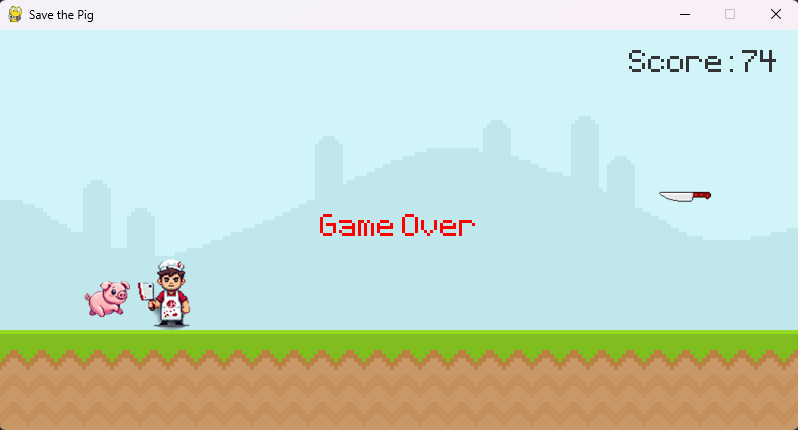

# Save the Pig!
# About this project

A simple game built with PyGame, in a 2D pixel art theme, bringing nostalgia to 80s games.
Project created for the Applied Programming Language subject at Uninter College.
Developed by Caio Alves de Souza - RU 4467638

## Objective

Save the pig from the butcher's clutches, try to jump over the butcher and dodge the flying knives for as long as possible.

## How to play?



Press **SPACE** to jump, **R** to play again, or **Close** the window game for see the Score.

## Usage

> Clone the repository

```bash
git clone https://github.com/caio-as/save-the-pig.git
```

> Install the required packages

```bash
pip install -r requirements.txt

```

> Run main.py

```bash or ide terminal
python main.py

```

## Contact

Caio Alves de Souza

> GitHub: [@caio-as](https://github.com/caio-as)

> LinkedIn: [Caio Alves de Souza](www.linkedin.com/in/caio-as)
